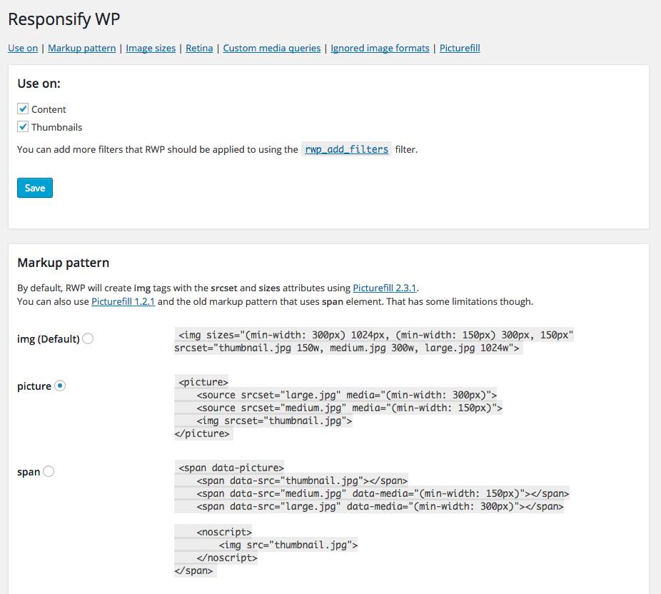
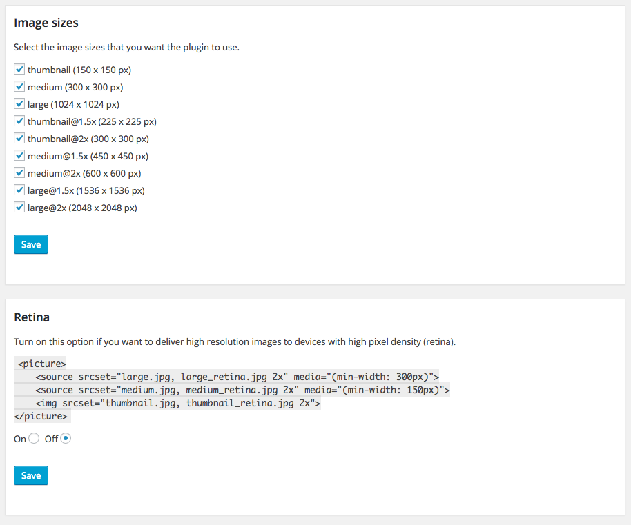
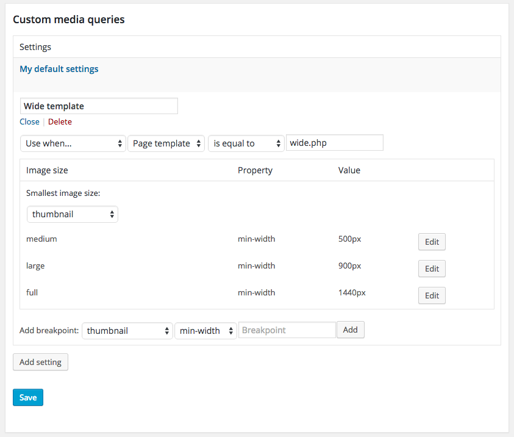
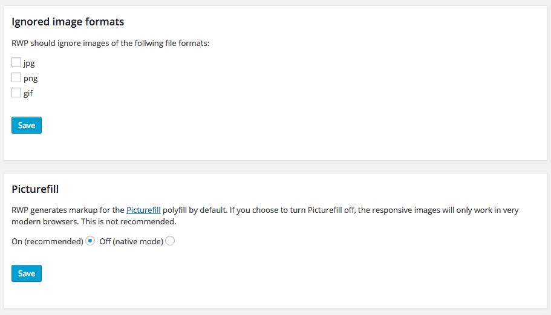

#Use on
  
Out of the box is Responsify WP applied to two filters, ``the_content`` (content inserted through the editor) and ``post_thumbnail_html`` (featured image).  
It's possible to add additional filters that RWP will be applied to using the [rwp_add_filters](/filters#add-filters) filter.

#Markup pattern
RWP will by default add ``srcset`` and ``sizes`` attributes to ``img`` tags. This is the [recommended markup pattern](http://blog.cloudfour.com/dont-use-picture-most-of-the-time/) for responsive images.  
With that said, feel free to use the ``picture`` element if you want to. RWP also supports the old ``span`` markup pattern that Picturefill used to have.

#Image sizes
  
If you have created an custom image size that you only uses in particular situations, just deselect it and RWP will ignore it!

#Retina
Turn on this option if you want to deliver high resolution images to devices with high pixel density (retina). See the [Retina section](/retina) of the documentation for instructions on how to get started.

#Custom media queries
 
There might be situations when you want to override the generated media queries. You can do this [programmatically in your templates](/settings#media-queries), but as of RWP 1.9, this can easily be done with this new user interface.  
Begin with clicking the **Add setting** button and give the new setting a name.  
Next, select if these settings should be applied everywhere or only in specific situations. The situations in which you can add your own media queries are these:

- When **Page ID** is... 
- When **Page slug** is... 
- When **Page template** is...
- When **Image class** is...
- When **Image size** is...

As you can see in the image above, it's possible to have a general default setting and then override this when needed. In this case, when the page template is equal to ``wide.php``.

#Ignored image formats
  
Using animated .gifs? Simply tell RWP to ignore those images by checking the checkbox.

#Picturefill
RWP generates markup for the Picturefill polyfill by default. If you choose to turn Picturefill off, the responsive images will only work in modern browsers.